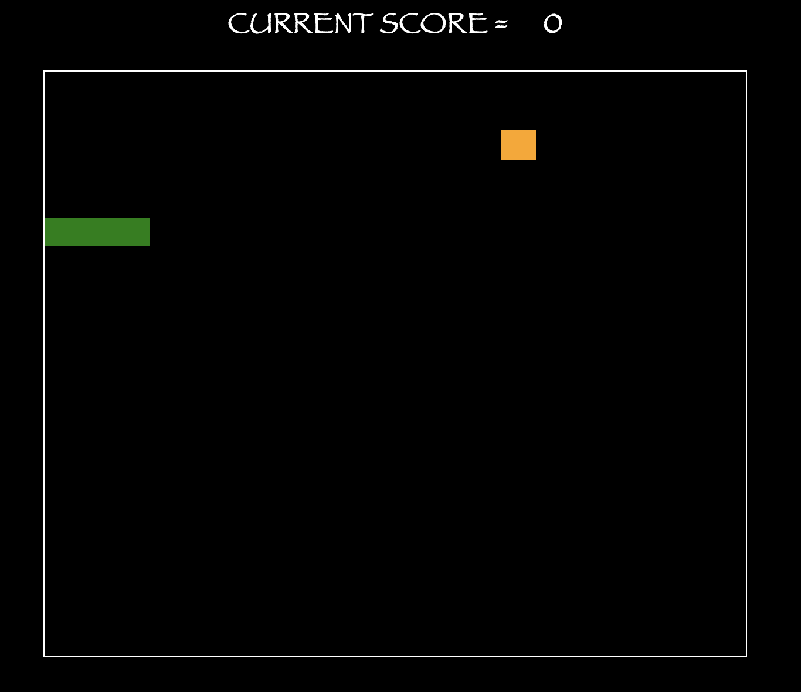

# SEI IDN 50 Project 1
# Project 1: Snake Game 

## Overview  
  
  Snake is a highly entertaining grid-based browser game. The objective is to maneuver the snake to collide with food which randomly spawns around the grid. As you collide with food, the difficulty increases where the snake grows in length and speed. Be careful not to collide with any walls or the snake itself as this will result in a game over. See how high you can score!  
  This was my first project as part of General Assembly's Software Engineering Immersive course. It was an individual project which was built in 7 days. This was the first proper game I have ever built, and my first ever experiences with Javascript, CSS and HTML. 

  The game was deployed using GitHub pages, and is available to play [here](https://izzleshab.github.io/SEI---Project---1/).

## Technologies Used

- HTML5

- CSS

- JavaScript

- GitHub

## My Approach

My initial approach to project 1 was to breakdown every step of the development process into smaller, managable steps until MVP was achieved. With this being my first project I wanted to leave myself plenty of time to style the game after reaching MVP.

- Step 1: Create the grid.
  - A straightforward 20 x 20 grid was created which acts as the gameboard. 

```javascript
  // * Grid Elements
  const width = 20 // Represents width & height
  const gridCellCount = width * width // Represents width * height.
  const cells = []

    function createGrid() {
    for (let i = 0; i < gridCellCount; i++) {
      const cell = document.createElement('div')
      cell.setAttribute('data-index', i)
      cells.push(cell)
      grid.appendChild(cell)
    }
  }

    createGrid()
```

- Step 2: Draw the snake and food.
  - I filled an array 'snakeBody' with x coordinate positions and coloured them using a forEach array method to create the body of the snake.
  
  - The food is created using a while loop that checks if food has been generated on the same coordinates as the snake, or at position -1 (offgrid) then generate a random position for the food object between a position of 0 and 400. 

```javascript
  const snakeBody = [{ x: 100 }, { x: 101 }, { x: 102 }]
  let foodObject = -1

    function draw(){ 
    if (gameEnd === false) {
      snakeBody.forEach(segment => {
        const snakeCell = document.querySelector('[data-index="' + segment.x + '"]')
        if (snakeCell !== null) {
          snakeCell.style.backgroundColor = 'green'
        }
      }) 
      if (oldSnakeBody !== isNaN) { // Prevents blacking out grid elements before snake starts moving.
        const oldSnakeCell = document.querySelector('[data-index="' + oldSnakeBody + '"]')
        if (oldSnakeCell !== null) { // This fixed a bug where the food woukld disappear on contact.
          oldSnakeCell.style.backgroundColor = 'black'
        }
      }
      if (foodObject !== -1) {
        const foodCell = document.querySelector('[data-index="' + foodObject + '"]')
        foodCell.style.backgroundColor = 'orange'
      } 
    } 
  }

  function generateFoodPosition() {
    while (foodCollision() === true || foodObject === -1) { 
      foodObject = Math.floor(Math.random() * (width * width)) 
    }
  }
```

- Step 3: Write the win logic for the game.
  - When the snake collides with the food: increase snake speed, increase snake size by 1, increase score by 1, generate new food position.
  
```javascript
  let snakeSpeed = 10
  const score = document.querySelector('.score') // Calls score id from HTML
  const header = document.querySelector('.header-score')
  const playAgain = document.querySelector('.play-again')
  header.innerHTML = 'CURRENT SCORE = ' // Current Score
  playAgain.style.display = 'none' // Hides the button until game over

    // Checks if snake head is = to food position, if yes, collision is true, therefore, new food position generated.
  function foodCollision() { 
    let collision = false
    snakeBody.forEach(segment => {
      if (segment.x === foodObject) {
        collision = true
      }
    })
    return collision
  }

    function foodInGameCollision() {
    if (foodCollision() === true) {
      // Point + 1 
      score.innerHTML++
      // increase snake speed
      snakeSpeed = snakeSpeed + 1
      // increase snake size
      snakeGrow = true 
      // randomise new food position
      generateFoodPosition()  
    }
  }
```

- Step 4: Write the lose logic for the game.
  - If the snake collides with a wall, or collides with itself, the game will end and a 'Play Again' button will be displayed.

```javascript
  let direction = ''

  function getHead() {
    return snakeBody[snakeBody.length - 1].x // Returns current cell number for the snake head.
  }

  function wallCollision(){ // Checks if snake hit a wall.
    if (direction === 'left' && getHead() % width === (width - 1)) {
      gameEnd = true
    }
    if (getHead() === -1){
      gameEnd = true
    }
    if (direction === 'right' && getHead() % width === 0) {
      gameEnd = true
    }
    if (direction === 'up' && getHead() < 0 ) {
      gameEnd = true
    }
    if (direction === 'down' && getHead() >= (width * width)) {
      gameEnd = true
    }
  }

  function selfCollision(){ // Checks if snake hit itself.
    for (let i = 0; i < snakeBody.length; i++) {
      if (i === snakeBody.length - 1) 
        return 
      else if (snakeBody[i].x === getHead()) 
        gameEnd = true
    }
  }
```
- Step 5: Write the logic for the movement of the snake.
  - Update the movement of the snake by removing the first item of the array and shifting it to the end of the array.
  - Key press event handlers which trigger the movement of snake.
```javascript

  // Activates movement on key press.
  function checkKey() {
    window.addEventListener('keydown', function(e) {
      if (e.keyCode === 38){
        direction = 'up'
      } else if (e.keyCode === 40){
        direction = 'down'
      } else if (e.keyCode === 37){
        direction = 'left'
      } else if (e.keyCode === 39){
        direction = 'right'
      }
    })  
  }

// Uses checkKey() direction to move the snakeBody. 
  // Removes first element of array and shifts to the last element of array with updated direction/movement.
  let oldSnakeBody = NaN

  function updateMovement() { 
    if (direction === 'up' || direction === 'down' || direction === 'left' || direction === 'right'){ // If movement happening: -
      if (snakeGrow === true) { // If snake growing - do not remove tail. 
        oldSnakeBody = NaN
        snakeGrow = false  
      } else { // Otherwise, remove tail. 
        oldSnakeBody = snakeBody[0].x // Keep track of old position, to recolour tail. 
        snakeBody.shift()
      }
    }
    if (direction === 'up'){
      if (snakeBody.length > 0){ // If default snake size 1, and tail removed, use oldSnakeBody for head movement.
        snakeBody.push({ x: getHead() - width }) // - width used for up direction, as width 20, -20 one row division upwards.
      } else {
        snakeBody.push({ x: oldSnakeBody - width })
      }
    }
    if (direction === 'down'){
      if (snakeBody.length > 0){ 
        snakeBody.push({ x: getHead() + width }) // + width used for down direction, as width 20, +20 is one row division downwards.
      } else {
        snakeBody.push({ x: oldSnakeBody + width })
      }
    }
    if (direction === 'left'){
      if (snakeBody.length > 0){
        snakeBody.push({ x: getHead() - 1 }) // Divs labelled '1, 2, 3' etc, so -1 moves snake in negative direction (left).
      } else {
        snakeBody.push({ x: oldSnakeBody - 1 })
      }
    }
    if (direction === 'right'){
      if (snakeBody.length > 0){
        snakeBody.push({ x: getHead() + 1 }) // +1 moves snakes in positive direction (right).
      } else {
        snakeBody.push({ x: oldSnakeBody + 1 })
      }
    }
  }
```

- At this point MVP was achieved and I moved onto styling the game.  

## Screenshots

**Game when first loaded.**



**Game over screen.**


## Bugs

- When the snake moves into itself, i.e., snake directionally moving right and player inputs a left movement command, the game will end as the snake has collided with itself. This is unintended.

## Wins 

- Getting to recreate a favourite childhood game of mine was a huge pleasure, and learning how the code behind this game worked was very enjoyable.

- Seeing the snake render in and move gave me huge satisfaction, likewise, creating the iconic square food node for the snake was a joy. 

## Challenges 

With this being my first solo project, I faced multiple challenges. These include:

- When writing the collision logic, the snake body would stop moving at the point of collision and a new snake would render on the opposite side of the food and continue moving, ending up with multiple snakes on the board.

- During the generation of a new food position, the food would duplicate in position and there would be multiple food nodes on the board.

- There was a bug where the snake could exit the game board at the very top right of the grid and the game would continue to run with no snake on the board.

## Future Content

- Removing the directional bug mentioned previously.

- Adding a highscore board where players can compete for a place in the top 5 or top 10.


